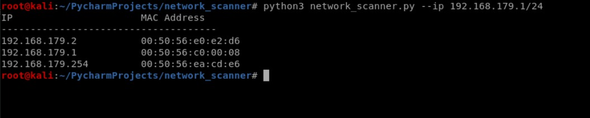

# NETWORK-SCANNER
 

# What is Network Scanner

==> This tool will scan your network to find other devices that are connected to the same network as you.  
==> It shows the MAC addresses and IP addresses of the devices on the network.  

# USAGE

<ul>
  <li>
    python3 network_scanner --ip 192.168.179.1/24
  </li>
  <li>
    python3 network_scanner -i 192.168.179.1/24
  </li>
</ul>
